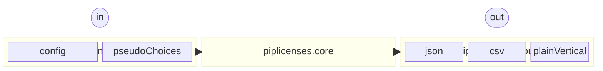

# How to contribute

## Design policy

The design policy of `pip-licenses` is as follows.

* Try to adhere to [S.O.L.I.D.](https://en.wikipedia.org/wiki/SOLID) principles

### Key Components

* Key Components by focus:
  * `piplicense.cli.*` -- Focus on the command-line input/parsing interface
  * `piplicenses.core` -- Focus only on gathering/auditing license information from Python packages installed in user's environment.
  * `piplicenses.output.*` -- Focus only on outputting license information of Python packages installed in user's environment.
  * `piplicenses.__init__.py` -- Focus only on imports and publishing an A.P.I.

### Compatibility

* Support Python 3.9 and later.
* External packages that depend on runtime are [prettytable](https://pypi.org/project/prettytable/) and [tomli](https://pypi.org/project/tomli/) only.
    * Expect to be able to use [importlib\_metadata](https://importlib_metadata.readthedocs.io/) APIs in `piplicenses.core`.
* Use builtins (e.g., `os`/`Paths`/`sys`/`io`/etc.) to avoid OS incompatibilities when needed.

## Setup

1. Fork this repository on your GitHub account.
2. Create a branch to represent changes.
    * Branch name does **NOT** need `feature/` prefix. Because git-flow is configured differently for maintainers.
3. Create a new venv environment and Install package for development via `make setup` .
    * Dependencies are managed by [pip-tools](https://pypi.org/project/pip-tools/).
    * If you want to add dependency packages for development, edit [the dev entry in pyproject.toml](https://github.com/raimon49/pip-licenses/blob/master/pyproject.toml) file and run `make update-depends` .
    * If you want to install the code under development, run `make local-install` .
    * If you want to test the code under development before pushing, run `make local-ci-check`

## Implementation and testing

* `pip-licenses` always measures code coverage for code quality. If you implement a new feature, please also write unit test in [test\_piplicenses.py](https://github.com/raimon49/pip-licenses/blob/master/test_piplicenses.py).
    * Tests can be run with `make test` .
* Code conventions follow the [PEP 8](https://www.python.org/dev/peps/pep-0008/).
    * You can format the code by running `make lint` .
* Send pull request to "next" branch. Maintainer(s) may adjust PRs to the appropriate development branch as relevant.

## Security policy

If you find a significant vulnerability, or evidence of one, please report it privately.

* We prefer that you use the
[GitHub mechanism for privately reporting a vulnerability](https://docs.github.com/en/code-security/security-advisories/guidance-on-reporting-and-writing/privately-reporting-a-security-vulnerability#privately-reporting-a-security-vulnerability).
Under the
[main repository's security tab](https://github.com/raimon49/pip-licenses/security), click
"Report a vulnerability" to open the advisory form.
